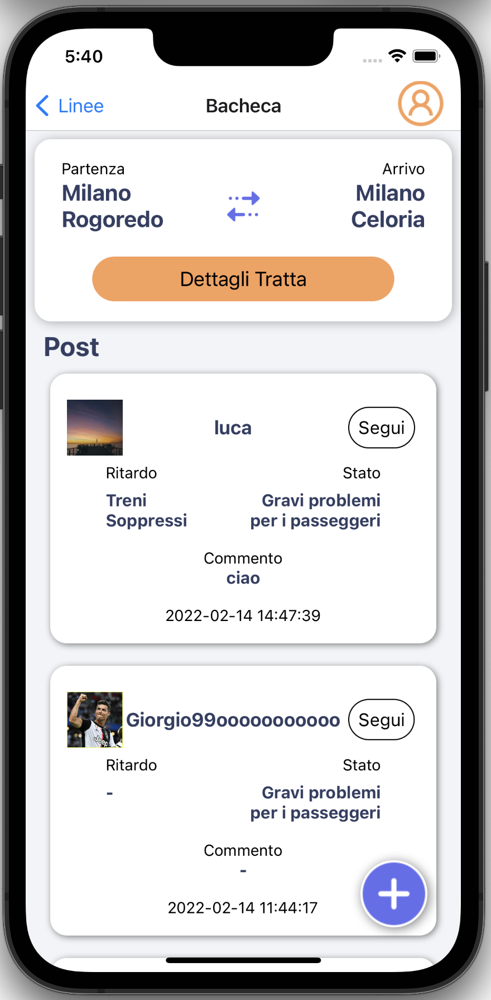
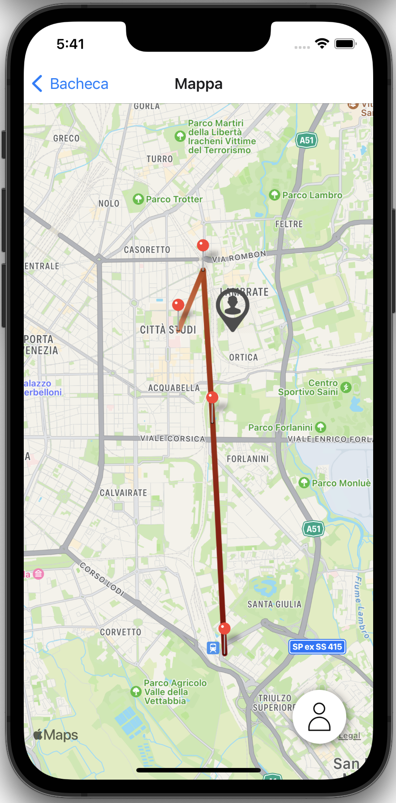
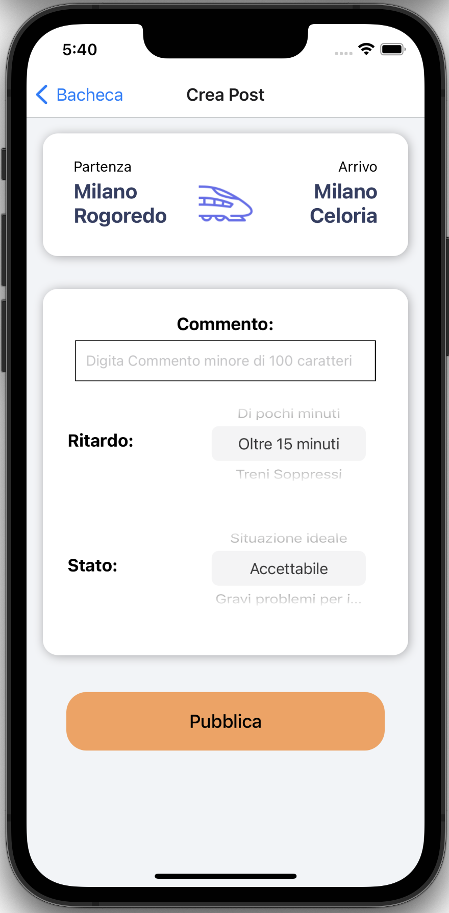

# App Cross Platform - MaledettaTreEst
### *Progetto React Native di Mobile Computing 2021/2022*

L'app vuole riprodurre l'esperienza di un social network per la segnalazione di ritardi/problemi del servizio di trasporto ferroviario della compagnia TreEst.
L'utente può scegliere una linea e una tratta per vedere i post pubblicati dagli utenti nella relativa bacheca.
Da ogni post, l’utente può scegliere se iniziare a seguire l'autore. I post degli utenti seguiti saranno evidenziati nella bacheca.
Inoltre l'utente può creare dei post e modificare il proprio profilo nell'app (nome utente e immagine del profilo).
Dalla bacheca è anche possibile visualizzare la mappa con tutte le stazioni della linea e la posizione corrente dell'utente.

---
<div align="center">
    
    
    
</div>

---
Per rendere lo sviluppo del prototipo veloce e senza particolari problemi è stato usato il tool [Expo](https://expo.dev/).

Per far partire l'app in locale basta eseguire da linea di comando

```bash
npm start
```
Poi avviare un simulatore e far partire l'app da expo